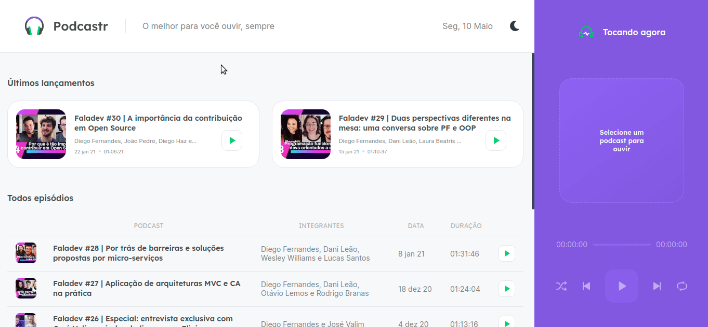

# 
## 📝 About
Podcastr is the project developed during the React track of the fifth edition of Next Level Week, a free and online event made by Rocketseat.

It is a web App that allows users to listen to their favorite podcasts, see the latest releases and get more information about the podcasts they are currently listening to.
## ⚙️ Libraries
- [x] Next.js
- [x] Typescript
- [x] Sass
- [x] Axios
- [x] Eslint
- [x] Prettier

## Features
- [x] Dark Mode
- [ ] responsiveness
- [ ] PWA

## Run project
```bash
  # Install dependecies
  yarn || npm install

  # Run json server
  yarn server || npm run server

  # Finally, reun dev script
  yarn dev || npm run dev
```

## Preview
